CallCenterAI – Intelligent Customer Ticket Classification
https://img.shields.io/badge/MLOps-Pipeline-blue
https://img.shields.io/badge/Python-3.11-green
https://img.shields.io/badge/FastAPI-0.104-lightblue
https://img.shields.io/badge/Docker-Containers-orange
https://img.shields.io/badge/License-MIT-yellow

An end-to-end MLOps solution for automatically classifying customer support tickets (emails, chat, phone transcripts) into business categories using dual NLP approaches: traditional TF-IDF + SVM and advanced Transformer models.

🎯 Project Overview
CallCenterAI is a production-ready MLOps system that intelligently routes and classifies customer tickets in real-time. The system features an AI agent that dynamically selects between two NLP models based on text complexity, language, and confidence scores, all within a fully containerized microservices architecture.

Key Features
Dual Model Architecture: TF-IDF + SVM for fast inference, Transformer (DistilBERT) for complex multilingual cases

Intelligent Routing Agent: AI-powered model selection with PII scrubbing

Full MLOps Pipeline: Experiment tracking, model registry, CI/CD, monitoring

Production Ready: Dockerized microservices, Prometheus/Grafana monitoring, comprehensive testing

Multilingual Support: French, English, Arabic with DistilBERT-base-multilingual

📊 System Architecture

🚀 Quick Start
Prerequisites
Docker & Docker Compose

Python 3.11 (for development)

Git

Deployment (One Command)
bash
# Clone the repository
git clone https://github.com/nessmattcash/CallCenterAI.git
cd CallCenterAI

# Start all services (this may take a few minutes)
docker-compose up -d
Verify Deployment
bash
# Check all running containers
docker ps

# Expected output:
# CONTAINER ID   IMAGE                          PORTS                    NAMES
# c7147903c37d   grafana/grafana:latest         0.0.0.0:3000->3000/tcp   callcenterai-grafana-1
# 21be240b101c   callcenterai-agent             0.0.0.0:8000->8000/tcp   callcenterai-agent-1
# ce362e950d9c   prom/prometheus:latest         0.0.0.0:9090->9090/tcp   callcenterai-prometheus-1
# 72ca644cad83   callcenterai-tfidf             0.0.0.0:8010->8010/tcp   callcenterai-tfidf-1
# ef92c635e1c7   callcenterai-transformer       0.0.0.0:8020->8020/tcp   callcenterai-transformer-1
# 7faac18d2526   ghcr.io/mlflow/mlflow:latest   0.0.0.0:5000->5000/tcp   callcenterai-mlflow-1
🔌 Service Endpoints
Service	URL	Port	Purpose
AI Agent	http://localhost:8000	8000	Main entry point, intelligent routing
TF-IDF Service	http://localhost:8010	8010	Traditional ML model
Transformer Service	http://localhost:8020	8020	Deep learning model
MLflow	http://localhost:5000	5000	Experiment tracking & model registry
Grafana	http://localhost:3000	3000	Monitoring dashboard
Prometheus	http://localhost:9090	9090	Metrics collection
📡 API Usage
1. Main AI Agent Endpoint
bash
curl -X POST http://localhost:8000/classify \
  -H "Content-Type: application/json" \
  -d '{
    "text": "My laptop screen is broken and I need a replacement. Please contact me at john.doe@company.com or call 12345678."
  }'
Example Response:

json
{
  "category": "Hardware",
  "confidence": 0.9945622647141518,
  "model_used": "TF-IDF + SVM",
  "model_choice_reason": "Short English (9 words)",
  "pii_scrubbed": true,
  "pii_details": {
    "emails": ["john.doe@company.com"],
    "phones": ["12345678"],
    "cins": ["12345678"],
    "names": []
  },
  "detected_language": "en"
}
2. Direct Model Endpoints
bash
# TF-IDF Service
curl -X POST http://localhost:8010/predict \
  -H "Content-Type: application/json" \
  -d '{"text": "Printer not working"}'

# Transformer Service
curl -X POST http://localhost:8020/predict \
  -H "Content-Type: application/json" \
  -d '{"text": "J ai un problème avec mon accès au système"}'
3. Model Metrics
bash
# Get Prometheus metrics from any service
curl http://localhost:8000/metrics
curl http://localhost:8010/metrics
curl http://localhost:8020/metrics
🏗️ Project Structure
text
CallCenterAI/
├── src/                          # Source code
│   ├── agent/                    # AI agent service
│   ├── tfidf_service/           # TF-IDF + SVM service
│   ├── transformer_service/     # Transformer service
│   ├── training/                # Model training scripts
│   └── utils/                   # Shared utilities
├── data/                        # Dataset and processed data
├── models/                      # Trained models
│   ├── tfidf_svm.pkl           # TF-IDF pipeline
│   └── transformer/            # Fine-tuned DistilBERT
├── docker/                      # Docker configurations
│   ├── Dockerfile.agent
│   ├── Dockerfile.tfidf
│   ├── Dockerfile.transformer
│   └── prometheus.yml
├── monitoring/                  # Grafana dashboards
├── tests/                       # Test suite
├── .github/workflows/          # CI/CD pipelines
├── docker-compose.yaml         # Full stack orchestration
├── dvc.yaml                    # Data pipeline
└── requirements.txt            # Python dependencies
🧪 Model Performance
TF-IDF + SVM
Accuracy: 94.8%

F1-Score: 94.7%

Inference Speed: ~10ms

Best For: Short English tickets, simple queries

DistilBERT Transformer
Accuracy: 92.3%

F1-Score: 91.8%

Inference Speed: ~50ms

Best For: Multilingual tickets, complex queries, nuanced language

🔧 Development Setup
1. Local Development
bash
# Create virtual environment
python -m venv venv
source venv/bin/activate  # On Windows: venv\Scripts\activate

# Install dependencies
pip install -r requirements.txt
pip install -r requirements-dev.txt  # Development dependencies

# Set up DVC for data versioning
dvc pull  # Download dataset from remote storage

# Run tests
pytest tests/ -v

# Train models
python train_and_log.py
2. Building Docker Images
bash
# Build individual services
docker build -f docker/Dockerfile.agent -t callcenterai-agent .
docker build -f docker/Dockerfile.tfidf -t callcenterai-tfidf .
docker build -f docker/Dockerfile.transformer -t callcenterai-transformer .

# Or build all at once
docker-compose build
📈 Monitoring & Observability
Grafana Dashboard
Access: http://localhost:3000

Default credentials: admin/admin

Pre-configured dashboard: dashboard.json

Dashboard Includes:

Real-time request rates per service

Model inference latency (P95, P99)

Error rates and status codes

Model selection distribution

Language detection statistics

MLflow Experiment Tracking
Access: http://localhost:5000

Track model experiments

Compare model performance

Model registry with staging/production

Artifact storage

🔄 CI/CD Pipeline
The project includes GitHub Actions workflows for:

Code Quality: Black, Flake8, Isort formatting

Testing: Unit and integration tests

Security: Bandit and Trivy scanning

Container Building: Automated Docker builds

Deployment: Model promotion to production

🧠 AI Agent Logic
The intelligent agent decides which model to use based on:

python
def choose_model(text, language, word_count, confidence_threshold=0.95):
    if language == "en" and word_count <= 10:
        return "TF-IDF + SVM"  # Fast, accurate for simple English
    else:
        return "DistilBERT"    # Better for multilingual/complex cases
PII Scrubbing: Automatically removes/masks:

Email addresses

Phone numbers

CIN numbers

Personal names

📋 Supported Categories
The system classifies tickets into 8 business categories:

Hardware - Equipment issues

Access - Login and permissions

Miscellaneous - General inquiries

HR Support - Human resources

Purchase - Procurement requests

Administrative rights - Permission changes

Storage - Data storage issues

Internal Project - Project-related tickets

🧪 Running Tests
bash
# Run all tests
pytest tests/ -v

# Run specific test categories
pytest tests/test_agent.py -v
pytest tests/test_integration.py -v
pytest tests/test_training.py -v

# With coverage report
pytest --cov=src tests/
🐛 Troubleshooting
Common Issues
Port conflicts:

bash
# Check if ports are already in use
netstat -ano | findstr :8000
Docker build fails:

bash
# Clear Docker cache
docker system prune -a
docker-compose build --no-cache
MLflow connection issues:

bash
# Check MLflow is running
curl http://localhost:5000
Model loading warnings:

These are version mismatch warnings and don't affect functionality

Can be safely ignored or fixed by retraining with current sklearn version

Logs Inspection
bash
# View logs for specific service
docker logs callcenterai-agent-1 --tail 50
docker logs callcenterai-tfidf-1 --follow

# View all logs
docker-compose logs -f
📊 Performance Benchmarks
Metric	TF-IDF Service	Transformer Service	Agent
Avg Latency	12ms	48ms	65ms
Throughput	82 req/s	21 req/s	15 req/s
CPU Usage	45%	85%	60%
Memory	120MB	890MB	210MB
🤝 Contributing
Fork the repository

Create a feature branch (git checkout -b feature/AmazingFeature)

Commit changes (git commit -m 'Add AmazingFeature')

Push to branch (git push origin feature/AmazingFeature)

Open a Pull Request

📄 License
This project is licensed under the MIT License - see the LICENSE file for details.

🙏 Acknowledgments
Dataset: IT Service Ticket Classification

Hugging Face for Transformer models

MLflow and DVC teams for MLOps tools

FastAPI for the excellent web framework

📞 Support
For issues, questions, or contributions:

Check existing GitHub Issues

Create a new issue with detailed description

Include logs, error messages, and steps to reproduce

Project Status: ✅ Production Ready
Last Updated: December 2025
Maintainer: Nessmatt Cash
Documentation: Complete with examples and troubleshooting

⭐ Star this repo if you found it useful! ⭐

